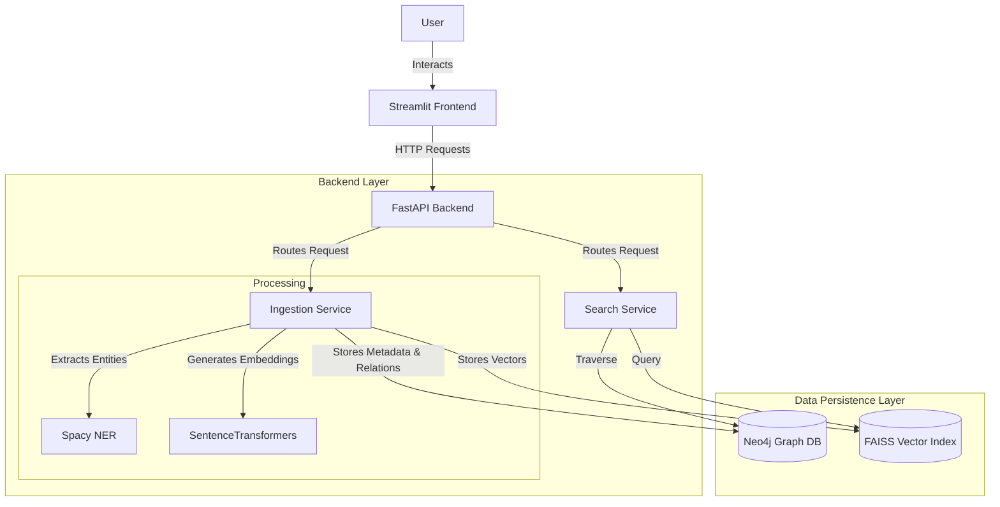

# 🧠 Hybrid Vector + Graph Retrieval System

A powerful, production-ready retrieval system that synergizes **Semantic Vector Search** (FAISS) with **Graph Knowledge Traversal** (Neo4j). This hybrid approach delivers context-aware search results by combining the speed of dense retrieval with the structured reasoning of knowledge graphs.

## 🏗️ Architecture

The system follows a modular microservices-like architecture, separating concerns between the frontend, backend API, and data persistence layers.



### Key Components
1.  **Streamlit Frontend**: An interactive dashboard for users to ingest documents, perform searches, and visualize the knowledge graph.
2.  **FastAPI Backend**: The core logic engine exposing RESTful endpoints for ingestion, search, and graph operations.
3.  **Ingestion Service**:
    *   **Text Chunking**: Splits large documents into manageable semantic chunks.
    *   **Vector Embedding**: Converts text to dense vectors using `all-MiniLM-L6-v2`.
    *   **Auto-NER**: Automatically extracts entities (Persons, Organizations, Locations) using Spacy and links them in the graph.
4.  **Search Service**:
    *   **Vector Search**: Retrieves top-k similar documents from FAISS.
    *   **Graph Search**: Traverses relationships in Neo4j to find connected concepts.
    *   **Hybrid Ranking**: Combines vector similarity scores with graph centrality and connectivity metrics for a unified relevance score.
5.  **Data Layer**:
    *   **Neo4j**: Stores structured data (Documents, Entities) and their relationships (e.g., `MENTIONS`, `RELATED_TO`).
    *   **FAISS**: High-performance similarity search for dense vectors.

---

## 🚀 Features

*   **Hybrid Search Algorithm**: Configurable weighting between vector similarity ($\alpha$) and graph connectivity ($\beta$).
*   **Smart Ingestion Pipeline**:
    *   Automated text cleaning and chunking.
    *   Entity extraction and linking (Document -> MENTIONS -> Entity).
*   **Interactive Graph Visualization**: Explore the neighborhood of search results dynamically.
*   **Database Inspector**: Built-in tools to inspect stored documents, entities, and vector index statistics.
*   **Dockerized Infrastructure**: Easy setup with Docker Compose for Neo4j.

---

## 🛠️ Tech Stack

*   **Language**: Python 3.12
*   **API Framework**: FastAPI
*   **Frontend**: Streamlit, Streamlit-Agraph
*   **Graph Database**: Neo4j (Community Edition)
*   **Vector Index**: FAISS (Facebook AI Similarity Search)
*   **NLP & ML**:
    *   `sentence-transformers` (Embeddings)
    *   `spacy` (Named Entity Recognition)
    *   `beautifulsoup4` (Text Cleaning)

---

## 📋 Prerequisites

*   **Docker** & **Docker Compose** (Essential for Neo4j)
*   **Python 3.8+**

---

## ⚡ Quick Start Guide

### 1. Start the Infrastructure
Launch the Neo4j database container.
```bash
docker-compose up -d
```
> **Note**: Neo4j will be available at `http://localhost:7474`.
> *   **Username**: `neo4j`
> *   **Password**: `password`

### 2. Set Up Python Environment
Create a virtual environment and install dependencies.
```bash
python3 -m venv venv
source venv/bin/activate
pip install -r requirements.txt
```

### 3. Download NLP Models
Download the Spacy model required for Named Entity Recognition.
```bash
python -m spacy download en_core_web_sm
```

### 4. Run the Backend
Start the FastAPI server.
```bash
uvicorn app.main:app --reload
```
*   API is running at: `http://localhost:8000`
*   Swagger Docs: `http://localhost:8000/docs`

### 5. Run the Frontend
Open a new terminal, activate the environment, and launch the UI.
```bash
source venv/bin/activate
streamlit run frontend/streamlit_app.py
```
*   Access the UI at: `http://localhost:8501`

---

## 📖 Usage Guide

### Ingestion
1.  Navigate to the **Ingestion** page in the sidebar.
2.  Enter a **Title** and **Content** for your document.
3.  Click **Ingest Document**.
    *   The system will chunk the text, generate embeddings, extract entities, and store everything in Neo4j and FAISS.

### Hybrid Search
1.  Go to the **Search** page.
2.  Select **Hybrid** as the Search Type.
3.  Adjust the sliders for **Vector Weight** vs **Graph Weight**.
4.  Enter a query (e.g., "database concepts") and search.
5.  View results with a detailed score breakdown (Vector Score vs Connectivity Score).

### Graph Visualization
1.  Go to **Graph Visualization**.
2.  Search by **Text Query** to find a starting concept.
3.  Click **Visualize** to see the interactive graph.
    *   **Yellow Nodes**: Start node.
    *   **Blue Nodes**: Documents.
    *   **Red Nodes**: Entities (People, Orgs, etc.).

---

## 📂 Project Structure

```
.
├── app/
│   ├── main.py            # FastAPI Entrypoint & Routes
│   ├── models.py          # Pydantic Data Models
│   ├── database.py        # Database Connection Logic (Neo4j/FAISS)
│   └── services/
│       ├── ingestion.py   # NLP Pipeline, Entity Extraction, Node Creation
│       └── search.py      # Hybrid Ranking & Search Algorithms
├── frontend/
│   └── streamlit_app.py   # Streamlit Dashboard Logic
├── data/                  # Persistent Data Storage (Docker Volumes)
├── tests/                 # Integration Tests
├── docker-compose.yml     # Infrastructure Configuration
└── requirements.txt       # Project Dependencies
```

## 🧪 Testing

Run the integration suite to verify system health.
```bash
pytest tests/test_integration.py
```

## 🤝 Contributing

Contributions are welcome! Please fork the repository and submit a pull request.

## 📄 License

This project is licensed under the MIT License.
